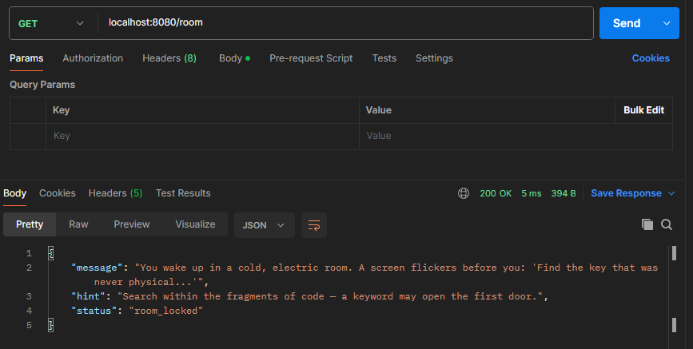
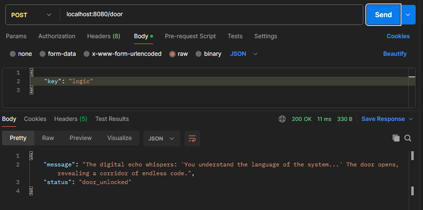
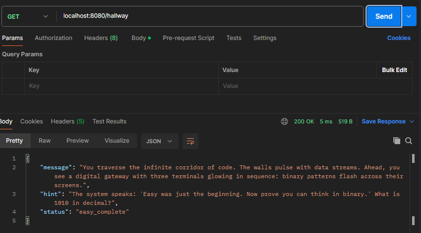
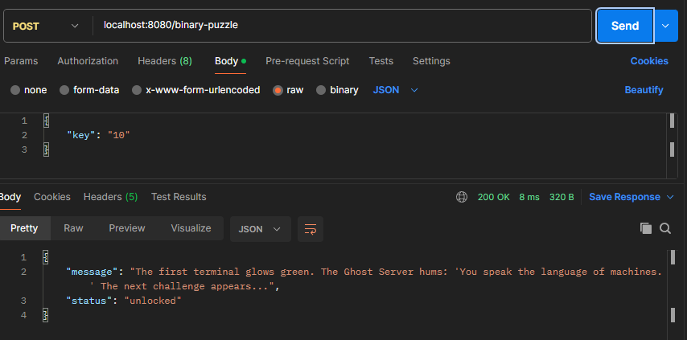
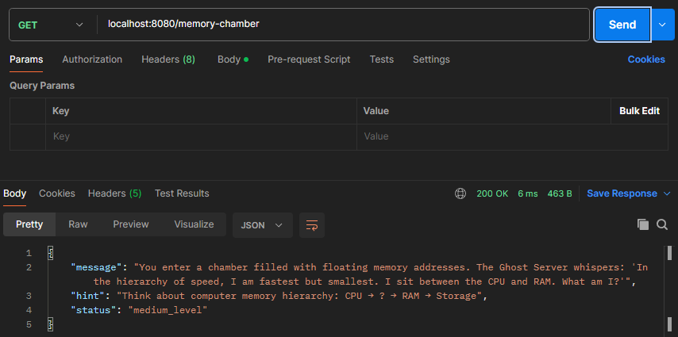
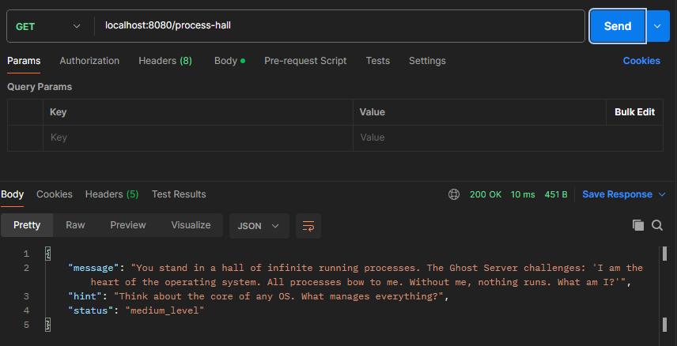
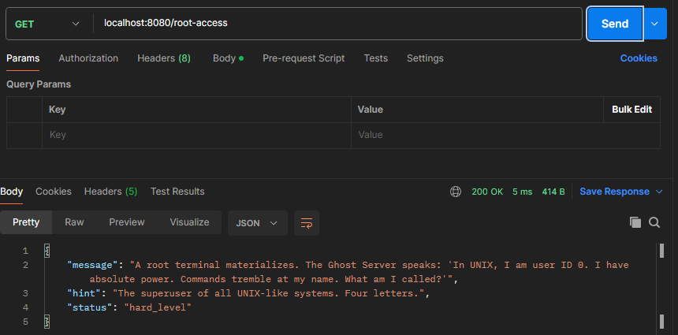
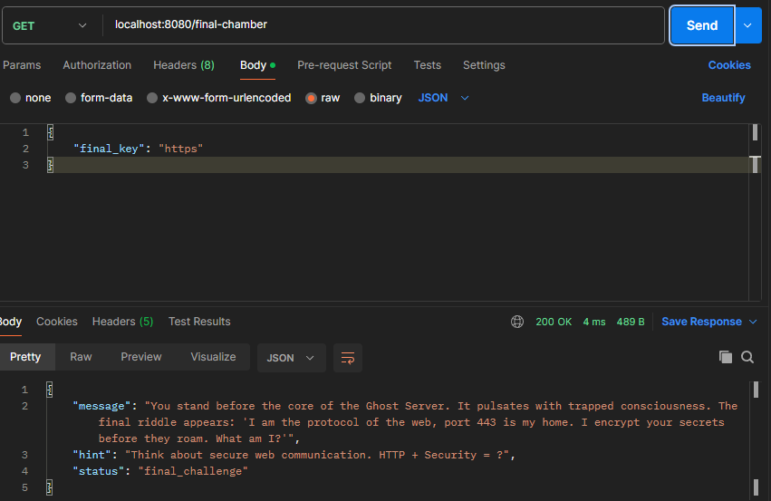

# 🧩 Haunted Escape Room - Postman Collection Guide

Each puzzle corresponds to an API request and is represented visually with an image stored in the /assets folder.  

Use this guide to explore all levels in Postman or any REST client.  

---

### 📗 *EASY LEVEL* (3 Puzzles)

#### 1. *The Electric Room* 💻

- *Image:* 

- *GET* /room - Wake up in the ghost server

- Discover the first clue to begin your journey

#### 2. *Unlock the Door* ✅

- *Image:* 

- *POST* /door - Submit the key you found

- Request body: {"key": "your_answer"}

- *Answer:* "logic"

#### 3. *The Code Corridor* 🌐

- *Image:* 

- *GET* /hallway - Enter the infinite corridor

- Receive a binary hint for the next level

---

### 📘 *MEDIUM LEVEL* (3 Puzzles)

#### 4. *Binary Challenge* 🔢

- *Image:* 

- *POST* /binary-puzzle - Convert binary to decimal

- Question: What is 1010 in decimal?

- Request body: {"key": "your_answer"}

- *Answer:* "10"

#### 5. *Memory Hierarchy* 🧠

- *Image:* 

- *GET* /memory-chamber - View the memory challenge

- *POST* /memory-puzzle - Solve it

- Question: Fastest memory type in computer architecture?

- Request body: {"key": "your_answer"}

- *Answer:* "cache"

#### 6. *The OS Core* ⚙

- *Image:* 

- *GET* /process-hall - View the process challenge

- *POST* /process-puzzle - Identify the core component

- Question: What runs all processes in an operating system?

- Request body: {"key": "your_answer"}

- *Answer:* "kernel"

---

### 📕 *HARD LEVEL* (3 Puzzles)

#### 7. *Cryptographic Decoding* 🔐

- *Image:* 

- *GET* /cryptic-terminal - Receive encrypted message

- *POST* /crypto-puzzle - Decode Base64

- Encrypted: aGVsbG8gd29ybGQ=

- Request body: {"key": "your_answer"}

- *Answer:* "base64:hello world"

#### 8. *Root Access* 👑

- *Image:* 

- *GET* /root-access - Access system permissions

- *POST* /root-puzzle - Identify the superuser

- Question: What is the name of the all-powerful user in Unix/Linux?

- Request body: {"key": "your_answer"}

- *Answer:* "root"

#### 9. *Final Escape* 🚪

- *Image:* 

- *GET* /final-chamber - The last challenge

- *POST* /escape - Free the digital soul

- Question: Secure protocol for web communication (port 443)?

- Request body: {"final_key": "your_answer"}

- *Answer:* "https" (also accepts: "ssl" or "tls")

---

## 💡 Tips for Postman Setup

- Use a *Postman environment* to store your answers as variables.

- Start with the *EASY* level and progress upward.

- Each successful response will reveal clues for the next endpoint.

- Set Content-Type: application/json for all POST requests.

---

*Project:* Haunted Escape Room API  

*Category:* Cyber Mystery / API Puzzle Challenge  

*Authors’ Notes:*  

These assets are part of the Haunted Escape Room API project — an experience combining logic puzzles, API requests, and a mysterious narrative.